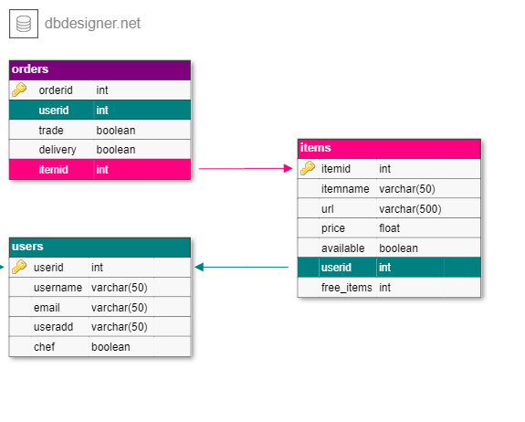
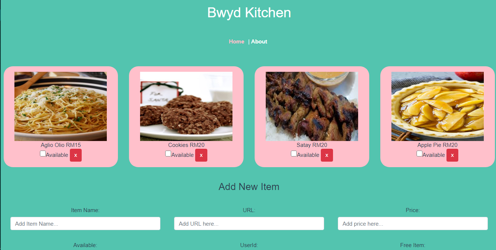

# bwyd Full Stack App

In this repository, you will use build a full stack bwyd app using Vue, Node/Express, and MySQL.

## Objectives

- Build a database.
- Build an API server.
- Create a front end.

## Setup

### Dependencies

Run `npm install` to install server-related dependencies.
`cd client` and run `npm install` install client dependencies.

Run `npm run serve` to run the development server.
Run `yarn` on root folder to install dependencies related to Express.

### Database Prep

Type `mysql -u root -p` to access the MySQL CLI using your password.
In the MySQL CLI, type `create database bwyd;` to create a database in MySQL.
Create `.env` file in project directory and add

```
DB_NAME=bwyd
DB_PASS=YOUR_PASSWORD
```

(replace `YOUR_PASSWORD` with your actual password)

Run `npm run migrate` in the main folder of this repository, in a new terminal window. This will create 4 tables (grades, students, subjects and teachers) in your database. This will create 3 tables in your database.

### Run Your Development Servers

- Run `npm start` in project directory to start the Express server on port 5000
- `cd client` and run `npm run serve` to start client server in development mode on port 8080.
- You can test your client app in `http://localhost:8080`
- You can test your API in `http://localhost:5000/api`

## Database schema

- 

## Homepage



## Resources

- [Vue docs - single file components](https://vuejs.org/v2/guide/single-file-components.html)
- [Vue docs - components](https://vuejs.org/v2/guide/components.html)
- [MySQL Cheat Sheet](http://www.mysqltutorial.org/mysql-cheat-sheet.aspx)
- [MySQL](https://dev.mysql.com/doc/refman/8.0/en/database-use.html)
- [Fetch](https://developer.mozilla.org/en-US/docs/Web/API/Fetch_API/Using_Fetch)
- [Promises](https://developer.mozilla.org/en-US/docs/Web/JavaScript/Reference/Global_Objects/Promise)

## Notes

_This is a student project that was created at [CodeOp](http://CodeOp.tech) & [Rebound](https://www.rebound.asia/), a full stack development bootcamp in Barcelona._
